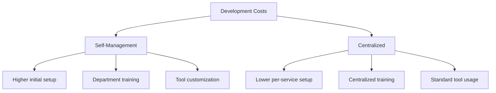
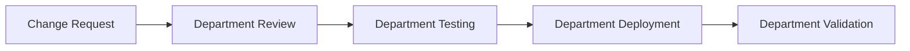
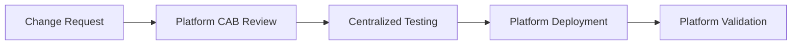

# Big Data Platform: Department Self-Management vs Centralized Management Comparison

## Executive Summary

This document provides a comprehensive comparison between Department Self-Management and Centralized Management models for big data interface platform deployment. The analysis covers key aspects including development efficiency, operational costs, governance, and long-term maintainability.

## 1. Management Model Overview

### Department Self-Management Model
```yaml
Management_Structure:
  Code_Ownership: "Business Departments"
  Deployment_Control: "Department CI/CD Pipelines"
  Operational_Responsibility: "Department DevOps Teams"
  Platform_Role: "Tool Provider & Consultant"
```

### Centralized Management Model
```yaml
Management_Structure:
  Code_Ownership: "Big Data Platform Team"
  Deployment_Control: "Centralized CI/CD Platform"
  Operational_Responsibility: "Central SRE Team"
  Platform_Role: "Full Service Provider"
```

## 2. Detailed Comparison Matrix

### Development Phase Comparison

| Aspect | Department Self-Management | Centralized Management |
|--------|---------------------------|------------------------|
| **Initial Setup Time** | 1-2 days (template customization) | < 1 day (standardized setup) |
| **Development Flexibility** | High (department can customize) | Limited (platform standards only) |
| **Code Generation Control** | Department controls generation parameters | Platform controls all generation logic |
| **Local Development** | Full local development environment | Limited to platform-approved tools |
| **Dependency Management** | Department manages dependencies | Centralized dependency management |

### Operational Phase Comparison

| Aspect | Department Self-Management | Centralized Management |
|--------|---------------------------|------------------------|
| **Deployment Frequency** | Department decides release schedule | Platform-controlled release windows |
| **Rollback Capability** | Department manages rollbacks | Automated platform rollback systems |
| **Scaling Decisions** | Department controls scaling policies | Platform-managed auto-scaling |
| **Cost Allocation** | Clear cost attribution to departments | Shared platform costs |
| **Performance Optimization** | Department-led optimization | Platform-wide optimization initiatives |

## 3. Cost Analysis

### Development Costs



**Detailed Breakdown:**

| Cost Category | Self-Management | Centralized Management |
|---------------|----------------|------------------------|
| **Initial Setup** | $$ (High - team training, environment setup) | $ (Low - standardized) |
| **Per Service Setup** | $$ (Medium - customization needed) | $ (Low - templated) |
| **Developer Training** | $$$ (Each department trains separately) | $ (Centralized training program) |
| **Tool Development** | $$ (Department-specific tools) | $$$ (Platform tool development) |

### Maintenance Costs

**Infrastructure Maintenance:**
```yaml
Self_Management_Maintenance:
  CI/CD_Pipelines: "Per department maintenance"
  Monitoring_Stack: "Department-managed"
  Security_Scans: "Department responsibility"
  Database_Management: "Department DBA teams"
  
Centralized_Maintenance:
  CI/CD_Pipelines: "Single platform team"
  Monitoring_Stack: "Centralized platform"
  Security_Scans: "Platform security team"
  Database_Management: "Central DBA team"
```

**Operational Cost Comparison:**
| Maintenance Area | Self-Management | Centralized |
|------------------|-----------------|-------------|
| **CI/CD Pipeline Maintenance** | 2-3 FTE per department | 4-5 FTE for entire platform |
| **Monitoring & Alerting** | 1-2 FTE per department | 2-3 FTE centralized |
| **Security Compliance** | 1 FTE per department | 2 FTE centralized |
| **Database Operations** | 1-2 FTE per department | 3-4 FTE centralized |

## 4. Common Component Change Management

### Change Impact Analysis

**Logging Framework Upgrade:**
```yaml
Self_Management_Scenario:
  Coordination_Effort: "High - multiple departments"
  Implementation_Time: "2-4 weeks (staggered)"
  Risk_Level: "Medium (inconsistent implementation)"
  Rollback_Complexity: "Department-specific rollback plans"
  
Centralized_Scenario:
  Coordination_Effort: "Low - single platform team"
  Implementation_Time: "1-2 days (synchronized)"
  Risk_Level: "Low (controlled rollout)"
  Rollback_Complexity: "Unified rollback strategy"
```

**Performance Optimization Changes:**
```yaml
Self_Management_Impact:
  Benefit_Distribution: "Uneven - depends on department adoption"
  Optimization_Effectiveness: "Variable across departments"
  Knowledge_Sharing: "Limited cross-department learning"
  Best_Practice_Adoption: "Slow and inconsistent"
  
Centralized_Impact:
  Benefit_Distribution: "Uniform - all services benefit"
  Optimization_Effectiveness: "Consistent across platform"
  Knowledge_Sharing: "Centralized expertise"
  Best_Practice_Adoption: "Immediate and consistent"
```

### Data Source Migration Cost

**Migration from Hive to Spark:**
```bash
# Self-Management Migration Timeline
Weeks 1-2: Department planning and assessment
Weeks 3-4: Individual department migrations
Weeks 5-6: Testing and validation per department
Weeks 7-8: Remaining department migrations

# Centralized Management Timeline  
Week 1: Platform-wide assessment and planning
Week 2: Automated migration tool development
Week 3: Bulk migration execution
Week 4: Platform-wide testing and optimization
```

## 5. Governance and Compliance

### Security and Compliance

| Governance Aspect | Self-Management | Centralized Management |
|-------------------|-----------------|------------------------|
| **Security Standards** | Department-defined with platform guidelines | Platform-enforced standards |
| **Compliance Auditing** | Per-department audit processes | Centralized audit platform |
| **Vulnerability Management** | Department-responsible patching | Platform-managed security updates |
| **Access Controls** | Department-managed access | Centralized RBAC system |
| **Data Governance** | Distributed data stewardship | Centralized data governance |

### Change Control Processes

**Self-Management Change Control:**


**Centralized Change Control:**


## 6. Scalability and Performance

### Horizontal Scaling Comparison

**Infrastructure Scaling:**
```yaml
Self_Management_Scaling:
  Resource_Provisioning: "Department requests resources"
  Scaling_Decisions: "Reactive - based on department metrics"
  Cost_Efficiency: "Variable - department optimization"
  Performance_Consistency: "Inconsistent across services"
  
Centralized_Scaling:
  Resource_Provisioning: "Platform auto-provisioning"
  Scaling_Decisions: "Proactive - platform-wide metrics"
  Cost_Efficiency: "Optimized - bulk resource management"
  Performance_Consistency: "Uniform across platform"
```

### Performance Metrics

**Response Time Consistency:**
- **Self-Management:** 50-200ms variation across departments
- **Centralized:** 10-50ms variation across services

**Resource Utilization:**
- **Self-Management:** 40-70% average utilization
- **Centralized:** 60-85% average utilization

## 7. Risk Assessment

### Technical Risks

| Risk Category | Self-Management | Centralized Management |
|---------------|-----------------|------------------------|
| **Single Point of Failure** | Distributed across departments | Central platform as SPOF |
| **Knowledge Concentration** | Department-specific expertise | Central team expertise |
| **Technology Fragmentation** | High risk of divergence | Low risk (enforced standards) |
| **Security Vulnerabilities** | Inconsistent patching | Consistent security updates |

### Business Risks

| Risk Category | Self-Management | Centralized Management |
|---------------|-----------------|------------------------|
| **Project Delivery Timeline** | Variable across departments | Predictable platform schedule |
| **Budget Overruns** | Department-level overruns | Platform-level budget control |
| **Compliance Violations** | Department-specific risks | Centralized compliance management |
| **Business Continuity** | Department-specific DR plans | Platform-wide disaster recovery |

## 8. Recommended Implementation Scenarios

### When to Choose Self-Management

**Ideal Conditions:**
```yaml
Organization_Size: "Large enterprises with specialized departments"
Team_Maturity: "Experienced DevOps teams in departments"
Application_Diversity: "Highly specialized or unique requirements"
Innovation_Requirement: "High need for department innovation"
Budget_Structure: "Department-level budgeting and cost accountability"
```

### When to Choose Centralized Management

**Ideal Conditions:**
```yaml
Organization_Size: "Medium to large enterprises"
Team_Maturity: "Limited DevOps expertise in departments"
Application_Standardization: "Similar requirements across departments"
Compliance_Requirements: "Strict regulatory compliance needs"
Cost_Optimization: "Focus on operational efficiency"
```

## 9. Hybrid Approach Recommendation

For most organizations, a hybrid approach provides optimal balance:

```yaml
Hybrid_Model:
  Platform_Responsibilities:
    - "Core framework development"
    - "Standard CI/CD templates"
    - "Centralized monitoring"
    - "Security compliance"
    - "Cost optimization"
    
  Department_Responsibilities:
    - "Business logic implementation"
    - "Department-specific configurations"
    - "User acceptance testing"
    - "Business metric monitoring"
    - "Department budget management"
```

### Hybrid Model Benefits

**Cost Efficiency:**
- 30-40% reduction compared to full self-management
- 15-20% increase compared to full centralized (due to flexibility needs)

**Implementation Timeline:**
- 4-6 weeks for initial platform setup
- 1-2 weeks per department onboarding

**Risk Mitigation:**
- Balanced risk distribution
- Gradual migration path available

## 10. Conclusion

The choice between self-management and centralized management depends on organizational size, technical maturity, and strategic objectives. While centralized management offers better cost control and consistency, self-management provides greater flexibility and innovation potential.

**Key Recommendation:** Start with a centralized approach for foundational services and gradually introduce self-management capabilities as department maturity increases. This balanced approach maximizes benefits while minimizing risks.

### Success Metrics for Evaluation

| Metric | Self-Management Target | Centralized Management Target |
|--------|------------------------|------------------------------|
| **Service Deployment Time** | < 2 days | < 4 hours |
| **Incident Resolution Time** | < 4 hours | < 1 hour |
| **Cost per Service** | Department budget | Platform allocation |
| **Developer Satisfaction** | 80%+ (flexibility) | 70%+ (reliability) |
| **Platform Reliability** | 99.5% | 99.9% |