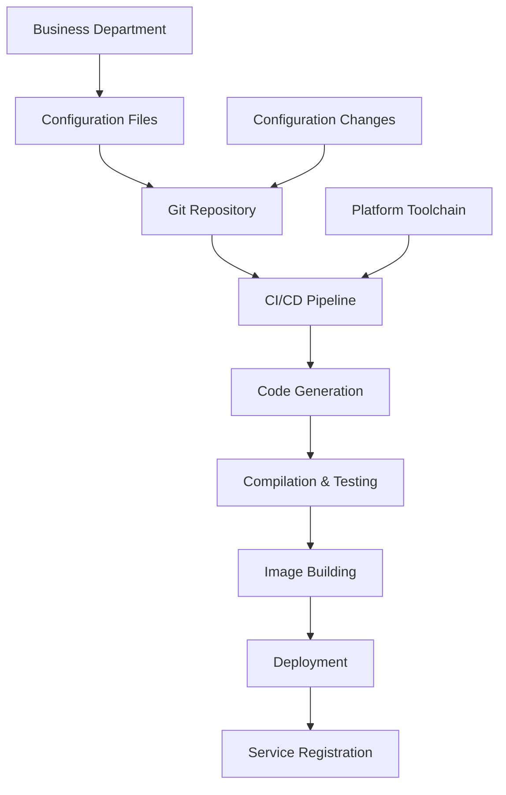

# Complete Implementation: Configuration-Driven Big Data Service Deployment

## 1. Overall Architecture Design



## 2. Business Department Configuration Specification

### Complete Service Configuration File
```yaml
# service-config.yaml - The only file business departments need to maintain
project:
  name: "user-profile-service"
  team: "user-team"
  version: "1.2.0"
  description: "User Profile Query Service"

# Data source configuration
datasources:
  - name: "user_hive"
    type: "hive"
    database: "user_db"
    tables: ["user_profile", "user_behavior"]
  - name: "user_redis"
    type: "redis"
    cluster: "redis-prod"

# Interface definitions
apis:
  - name: "getUserProfile"
    path: "/api/v1/user/{userId}"
    method: "GET"
    description: "Get user basic profile"
    sql: |
      SELECT user_id, name, email, create_time 
      FROM user_profile 
      WHERE user_id = #{userId}
    cache:
      enabled: true
      ttl: 300
      key: "user:profile:${userId}"
    rate_limit:
      enabled: true
      capacity: 1000
      refill_rate: 100

  - name: "updateUserProfile"
    path: "/api/v1/user/{userId}"
    method: "PUT"
    description: "Update user profile"
    sql: |
      UPDATE user_profile 
      SET name = #{name}, email = #{email}
      WHERE user_id = #{userId}
    rate_limit:
      enabled: true
      capacity: 100
      refill_rate: 10

# Deployment configuration
deployment:
  environments:
    staging:
      replicas: 2
      resources:
        cpu: "500m"
        memory: "1Gi"
    production:
      replicas: 3
      resources:
        cpu: "1000m"
        memory: "2Gi"
  health_check:
    path: "/actuator/health"
    initial_delay: 30
    period: 10

# Monitoring and alerts
monitoring:
  metrics:
    - "qps"
    - "latency"
    - "error_rate"
  alerts:
    - metric: "latency_p95"
      condition: "> 1000"
      severity: "warning"
    - metric: "error_rate"
      condition: "> 5%"
      severity: "critical"
```

## 3. Complete CI/CD Pipeline Implementation

### GitLab CI Complete Configuration
```yaml
# .gitlab-ci.yml - Provided by platform templates, no modification needed by business departments
include:
  - project: 'bigdata-platform/ci-templates'
    file: '/templates/fullstack-pipeline.yml'

variables:
  SERVICE_CONFIG: "service-config.yaml"
  GENERATED_CODE_DIR: "generated-code"

stages:
  - validate
  - generate
  - test
  - security_scan
  - build
  - deploy_staging
  - integration_test
  - deploy_production

workflow:
  rules:
    - if: '$CI_COMMIT_BRANCH == "main"'
    - if: '$CI_COMMIT_BRANCH == "develop"'
    - if: '$CI_PIPELINE_SOURCE == "merge_request_event"'

# Stage 1: Configuration Validation
validate_config:
  stage: validate
  image: bigdata-cli:latest
  script:
    - bigdata-cli validate --config $SERVICE_CONFIG --strict
    - bigdata-cli check-resources --config $SERVICE_CONFIG
  artifacts:
    paths:
      - validation-report.json
    expire_in: 1 week

# Stage 2: Code Generation
generate_code:
  stage: generate
  image: bigdata-cli:latest
  script:
    - echo "Starting code generation..."
    - bigdata-cli generate 
        --config $SERVICE_CONFIG 
        --output $GENERATED_CODE_DIR
        --template standard-api
    - echo "Code generation completed"
    
    # Commit generated code (optional)
    - git config user.email "ci@bigdata-platform.com"
    - git config user.name "BigData CI"
    - git add $GENERATED_CODE_DIR/
    - git commit -m "Auto-generated: code for ${CI_COMMIT_SHA}" || echo "No changes to commit"
    - git push origin $CI_COMMIT_BRANCH || echo "Push failed or no changes"
    
  artifacts:
    paths:
      - $GENERATED_CODE_DIR/
    expire_in: 1 week
  dependencies:
    - validate_config

# Stage 3: Unit Testing
unit_test:
  stage: test
  image: maven:3.8-openjdk-11
  dependencies:
    - generate_code
  script:
    - cd $GENERATED_CODE_DIR
    - mvn clean test -DskipTests=false
    - mvn jacoco:report
  artifacts:
    paths:
      - $GENERATED_CODE_DIR/target/site/jacoco/
    reports:
      junit: $GENERATED_CODE_DIR/target/surefire-reports/*.xml

# Stage 4: Security Scanning
security_scan:
  stage: security_scan
  image: security-scanner:latest
  dependencies:
    - generate_code
  script:
    - cd $GENERATED_CODE_DIR
    - dependency-check.sh --out . --scan .
    - sonar-scanner 
        -Dsonar.projectKey=$CI_PROJECT_NAME 
        -Dsonar.sources=.
        -Dsonar.host.url=$SONAR_URL
  artifacts:
    paths:
      - $GENERATED_CODE_DIR/dependency-check-report.html

# Stage 5: Build Image
build_image:
  stage: build
  image: docker:20.10
  services:
    - docker:dind
  dependencies:
    - generate_code
  script:
    - cd $GENERATED_CODE_DIR
    - docker build -t $CI_REGISTRY_IMAGE:$CI_COMMIT_SHA .
    - docker push $CI_REGISTRY_IMAGE:$CI_COMMIT_SHA
    - docker tag $CI_REGISTRY_IMAGE:$CI_COMMIT_SHA $CI_REGISTRY_IMAGE:latest
    - docker push $CI_REGISTRY_IMAGE:latest
  only:
    - main
    - develop

# Stage 6: Deploy to Staging
deploy_staging:
  stage: deploy_staging
  image: kubectl:latest
  environment:
    name: staging
    url: https://staging-$CI_PROJECT_NAME.platform.company.com
  script:
    - kubectl apply -f $GENERATED_CODE_DIR/k8s/staging/
    - bigdata-cli wait-for-rollout 
        --namespace bigdata-staging 
        --deployment $CI_PROJECT_NAME 
        --timeout 300s
    - bigdata-cli register-service 
        --name $CI_PROJECT_NAME 
        --environment staging 
        --version $CI_COMMIT_SHA
  when: manual

# Stage 7: Integration Testing
integration_test:
  stage: integration_test
  image: curlimages/curl:latest
  dependencies:
    - deploy_staging
  script:
    - bigdata-cli integration-test 
        --service $CI_PROJECT_NAME 
        --environment staging 
        --config $SERVICE_CONFIG
  artifacts:
    paths:
      - integration-test-report.html

# Stage 8: Deploy to Production
deploy_production:
  stage: deploy_production
  image: kubectl:latest
  environment:
    name: production
    url: https://$CI_PROJECT_NAME.platform.company.com
  script:
    - |
      if [ "$APPROVED" = "true" ]; then
        kubectl apply -f $GENERATED_CODE_DIR/k8s/production/
        bigdata-cli wait-for-rollout \
          --namespace bigdata-production \
          --deployment $CI_PROJECT_NAME \
          --timeout 600s
        bigdata-cli register-service \
          --name $CI_PROJECT_NAME \
          --environment production \
          --version $CI_COMMIT_SHA
        bigdata-cli notify \
          --channel "#deployments" \
          --message "Service $CI_PROJECT_NAME successfully deployed to production"
      else
        echo "Approval required for production deployment"
        exit 1
      fi
  when: manual
  only:
    - main
```

## 4. Enhanced Code Generation Tool

### Generate Complete Project Structure
```bash
# Enhanced code generation tool functionality
bigdata-cli generate \
  --config service-config.yaml \
  --output generated-code \
  --template standard-api \
  --include-k8s \          # Generate K8s configurations
  --include-monitoring \    # Generate monitoring configurations
  --include-docs \         # Generate API documentation
  --validate-dependencies  # Validate dependency compatibility
```

### Generated Complete Project Structure
```
generated-code/
├── src/
│   ├── main/
│   │   ├── java/com/company/bigdata/
│   │   │   ├── Application.java
│   │   │   ├── controller/           # Generated Controllers
│   │   │   ├── service/              # Generated Services
│   │   │   ├── repository/           # Data access layer
│   │   │   └── config/               # Auto-configuration classes
│   │   └── resources/
│   │       ├── application.yaml      # Application configuration
│   │       ├── logback-spring.xml    # Logging configuration
│   │       └── sql/                  # SQL files
│   └── test/
│       └── java/                     # Generated test code
├── k8s/
│   ├── staging/
│   │   ├── deployment.yaml
│   │   ├── service.yaml
│   │   └── configmap.yaml
│   └── production/
│       ├── deployment.yaml
│       ├── service.yaml
│       └── hpa.yaml                 # Auto-scaling
├── docker/
│   ├── Dockerfile
│   └── entrypoint.sh
├── docs/
│   ├── api-spec.yaml                # OpenAPI documentation
│   └── user-guide.md
├── Jenkinsfile                      # Pipeline script
├── pom.xml                         # Maven configuration
├── Makefile
└── README.md
```

## 5. Automated Docker Image Building

### Smart Dockerfile Generation
```dockerfile
# generated-code/docker/Dockerfile
FROM openjdk:11-jre-slim as runtime

# Security hardening
RUN groupadd -r bigdata && useradd -r -g bigdata bigdata && \
    apt-get update && apt-get install -y curl && rm -rf /var/lib/apt/lists/*

# Application deployment
WORKDIR /app
COPY target/*.jar app.jar
COPY src/main/resources/ /app/resources/

# Health check
HEALTHCHECK --interval=30s --timeout=3s --start-period=120s --retries=3 \
    CMD curl -f http://localhost:8080/actuator/health || exit 1

# Security context
USER bigdata
EXPOSE 8080

# JVM tuning - automatically adjusted based on resource configuration
ENV JAVA_OPTS="-XX:+UseContainerSupport -XX:MaxRAMPercentage=75.0 -Djava.security.egd=file:/dev/./urandom"

ENTRYPOINT ["sh", "-c", "java $JAVA_OPTS -jar /app/app.jar"]
```

## 6. Automated K8s Deployment Configuration Generation

### Generate Differentiated Configurations Based on Environment
```yaml
# generated-code/k8s/production/deployment.yaml
apiVersion: apps/v1
kind: Deployment
metadata:
  name: user-profile-service
  labels:
    app.kubernetes.io/name: user-profile-service
    app.kubernetes.io/version: "1.2.0"
    app.kubernetes.io/managed-by: bigdata-platform
  annotations:
    # Auto-generated annotations
    bigdata.platform/generated-at: "2024-01-20T10:30:00Z"
    bigdata.platform/config-version: "1.2.0"
spec:
  replicas: 3
  selector:
    matchLabels:
      app: user-profile-service
  template:
    metadata:
      labels:
        app: user-profile-service
      annotations:
        # Monitoring configuration
        prometheus.io/scrape: "true"
        prometheus.io/port: "8080"
        prometheus.io/path: "/actuator/prometheus"
        # Tracing
        sidecar.istio.io/inject: "true"
    spec:
      containers:
      - name: user-profile-service
        image: "registry.company.com/bigdata/user-profile-service:${COMMIT_SHA}"
        ports:
        - containerPort: 8080
        env:
        - name: SPRING_PROFILES_ACTIVE
          value: "production"
        - name: JAVA_OPTS
          value: "-Xmx1536m -Xms512m"
        resources:
          requests:
            memory: "1Gi"
            cpu: "500m"
          limits:
            memory: "2Gi"
            cpu: "1000m"
        livenessProbe:
          httpGet:
            path: /actuator/health/liveness
            port: 8080
          initialDelaySeconds: 60
          periodSeconds: 10
        readinessProbe:
          httpGet:
            path: /actuator/health/readiness
            port: 8080
          initialDelaySeconds: 30
          periodSeconds: 5
        # Auto-mount configuration
        volumeMounts:
        - name: config-volume
          mountPath: /app/config
      volumes:
      - name: config-volume
        configMap:
          name: user-profile-service-config
---
# Auto-generated HPA
apiVersion: autoscaling/v2
kind: HorizontalPodAutoscaler
metadata:
  name: user-profile-service-hpa
spec:
  scaleTargetRef:
    apiVersion: apps/v1
    kind: Deployment
    name: user-profile-service
  minReplicas: 2
  maxReplicas: 10
  metrics:
  - type: Resource
    resource:
      name: cpu
      target:
        type: Utilization
        averageUtilization: 70
```

## 7. Business Department Operation Process

### Extremely Simplified Operations
```bash
# 1. Business department creates configuration file
mkdir my-bigdata-service
cd my-bigdata-service

# 2. Create service configuration
cat > service-config.yaml << 'EOF'
project:
  name: "my-user-service"
  team: "user-team"
apis:
  - name: "getUser"
    path: "/api/user/{id}"
    method: "GET"
    sql: "SELECT * FROM users WHERE id = #{id}"
EOF

# 3. Commit to Git
git init
git add .
git commit -m "Initial service configuration"
git remote add origin https://git.company.com/user-team/my-user-service.git
git push -u origin main

# 4. Done! CI/CD automatically handles all subsequent processes
```

### Web Interface Creation (Optional)
For non-technical users, provide a web interface:
1. Log in to the Big Data Platform web interface
2. Configure service through forms
3. System automatically creates Git repository and submits configuration
4. Automatically triggers first build and deployment

## 8. Advanced Features

### Environment-Specific Configuration Overrides
```yaml
# service-config.yaml supports environment overrides
deployment:
  base:
    replicas: 2
    resources:
      cpu: "500m"
      memory: "1Gi"
  environments:
    staging:
      replicas: 2
      resources:
        cpu: "500m"
        memory: "1Gi"
    production:
      replicas: 4
      resources:
        cpu: "1000m"
        memory: "2Gi"
```

### Dependency Service Auto-Configuration
```yaml
dependencies:
  - name: "user-cache"
    type: "redis"
    config:
      host: "redis-cluster"
      port: 6379
  - name: "auth-service"
    type: "http"
    config:
      url: "https://auth.internal.company.com"
      timeout: 5000
```

## 9. Monitoring and Operations

### Automatic Registration to Governance Platform
```java
// Generated startup class automatically registers
@SpringBootApplication
@EnableBigDataPlatform
public class Application {
    
    @PostConstruct
    public void registerService() {
        // Automatically register service with platform
        PlatformRegistry.register(
            ServiceInfo.builder()
                .name("user-profile-service")
                .version("1.2.0")
                .team("user-team")
                .build()
        );
    }
    
    public static void main(String[] args) {
        SpringApplication.run(Application.class, args);
    }
}
```

## 10. Key Advantages

### For Business Departments
- **Zero coding**: Only maintain configuration files
- **One-click deployment**: Git Push triggers complete process
- **Standardization**: Automatically get best practices
- **Focus on business**: No need to care about technical details

### For Platform Teams
- **Complete control**: Unified technology stack and architecture
- **Quality assurance**: All services go through same quality gates
- **Maximum efficiency**: New service deployment time reduced from days to minutes
- **Simplified operations**: Standardized deployment and monitoring

This model truly achieves "Configuration as Code" and "GitOps", allowing business departments to focus only on business logic configuration, while all technical complexity is automated in the CI/CD pipeline.