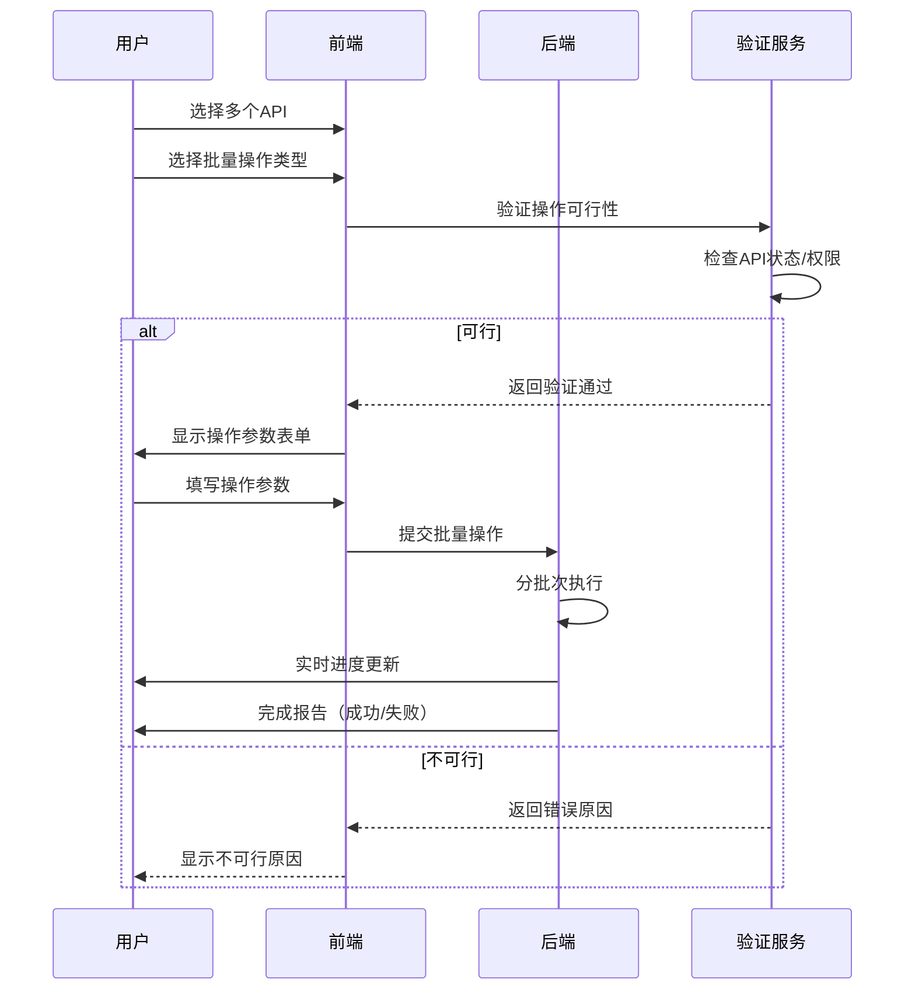

## 4.2.9 API管理界面设计（深度细化）

> **设计原则**：
> - **业务导向**：列表展示业务关键指标，而非技术细节
> - **一目了然**：关键状态通过视觉设计直观呈现
> - **高效操作**：常用操作一键可达，减少点击次数
> - **个性化体验**：支持自定义视图，满足不同角色需求

### 4.2.9.1 API列表视图设计

#### 基础布局与交互

| **区域** | **详细设计** | **业务价值** | **交互规则** | **响应式设计** |
|----------|--------------|--------------|--------------|----------------|
| **筛选区** | • 顶部固定筛选栏 • 业务域选择器（多选） • 状态筛选（活跃/废弃/下线） • 搜索框（支持API名称/描述搜索） | 快速定位目标API | • 筛选条件实时生效 • 支持保存常用筛选组合 • 高级筛选弹出面板 | • 移动端折叠为"筛选"按钮 • 小屏幕优先显示核心筛选项 |
| **操作区** | • 批量操作下拉菜单 • "创建API"主按钮 • 视图切换（列表/卡片） • 刷新按钮 | 高效执行管理操作 | • 选中API后批量操作可用 • 主按钮使用醒目的CTA设计 • 操作结果实时反馈 | • 移动端将操作整合到浮动按钮 • 小屏幕隐藏次要操作 |
| **列表区** | • 表格形式展示API • 支持列宽调整 • 行悬停高亮 • 行点击展开详情 | 清晰展示API信息 | • 单击行选择API • 双击行打开详情页 • 支持行内快速编辑 | • 卡片视图更适合移动端 • 小屏幕显示核心列 |
| **分页区** | • 页码导航 • 每页数量选择（10/25/50/100） • 跳转到指定页 | 处理大量API | • 滚动到底部自动加载（可选） • 分页状态持久化 | • 移动端简化分页控件 • 小屏幕显示精简分页 |

#### API列表列定义（默认视图）

| **列名** | **详细设计** | **数据来源** | **排序规则** | **特殊交互** |
|----------|--------------|--------------|--------------|--------------|
| **选择** | • 复选框 • 点击选择单个API • Shift+点击选择范围 | 前端交互 | - | • 全选/取消全选 • 选中后批量操作可用 |
| **状态** | • 视觉标识：   - 活跃：绿色圆点   - 废弃：黄色三角   - 下线：灰色叉 • 悬停显示详细状态 | API元数据 | 状态优先级排序 | • 点击状态可快速变更 • 悬停显示状态详情 |
| **API名称** | • 业务名称（非技术名） • 悬停显示技术路径 • 敏感API显示锁图标 | API元数据 | 按名称字母排序 | • 点击打开详情页 • 支持行内编辑名称 |
| **业务域** | • 业务分类标签 • 多业务域用逗号分隔 | API元数据 | 按业务域分组排序 | • 点击可筛选同业务域API |
| **调用量** | • 今日调用量（数字） • 7日趋势图（迷你折线图） • 悬停显示详细统计 | 监控系统 | 按调用量降序 | • 点击打开调用量详情 |
| **错误率** | • 百分比显示 • 超阈值标红（>1%） • 悬停显示错误详情 | 监控系统 | 按错误率升序 | • 点击查看错误日志 |
| **SLA状态** | • 达标：绿色对勾 • 警告：黄色感叹号 • 未达标：红色叉 • 悬停显示详细指标 | 监控系统 | SLA优先级排序 | • 点击查看SLA详情 |
| **最后更新** | • 相对时间（如"2小时前"） • 悬停显示绝对时间 | API元数据 | 按更新时间倒序 | • 点击可查看变更历史 |
| **操作** | • 详情 • 编辑 • 下线 • 复制 • 删除（谨慎操作） | 前端配置 | - | • 悬停显示操作说明 • 危险操作需二次确认 |

> **关键视觉设计**：
> - **状态标识系统**：使用颜色+图标双重编码，色盲友好
> - **调用量趋势**：迷你折线图使用渐变色，上升绿色，下降红色
> - **错误率提示**：阈值标红，悬停显示具体错误类型分布
> - **SLA状态**：直观反映业务影响，而非技术指标

#### 列自定义功能

| **功能** | **详细设计** | **业务价值** | **交互规则** | **限制** |
|----------|--------------|--------------|--------------|----------|
| **列选择** | • "列设置"弹出面板 • 可勾选/取消列显示 • 拖拽调整列顺序 | 按角色定制视图 | • 实时预览效果 • 支持恢复默认设置 | • 至少保留3个核心列 • 敏感列需权限才能隐藏 |
| **列冻结** | • 左侧固定关键列 • 水平滚动时冻结列保持可见 | 处理宽表格 | • 拖拽列分割线设置冻结范围 • 支持多列冻结 | • 最多冻结3列 • 冻结列不能调整顺序 |
| **列分组** | • 按业务域/状态分组 • 折叠/展开分组 | 快速浏览同类API | • 拖拽列头到分组区域 • 支持多级分组 | • 最多2级分组 • 分组后保持排序 |
| **列计算** | • 添加计算列 • 例如：成本/调用量 | 深度分析API价值 | • 选择计算公式 • 支持自定义表达式 | • 计算列不保存 • 复杂计算需审批 |

> **个性化视图管理**：
> - **保存视图**：命名并保存当前筛选、排序和列配置
> - **视图共享**：与团队成员共享自定义视图
> - **视图订阅**：接收视图中API的变化通知
> - **默认视图**：按角色预设（管理员/开发者/业务分析师）

### 4.2.9.2 API详情页设计

#### 详情页布局与导航

| **区域** | **详细设计** | **业务价值** | **交互规则** |
|----------|--------------|--------------|--------------|
| **导航区** | • 顶部标签页导航：   - 概览   - 配置   - 监控   - 文档   - 日志   - 变更历史 • 当前API面包屑 | 快速切换详情维度 | • 标签页状态持久化 • 未保存更改提示 | 
| **操作区** | • 顶部操作按钮：   - 编辑   - 下线   - 复制   - 删除   - 导出配置 • 操作权限动态控制 | 高效执行管理操作 | • 操作结果实时反馈 • 危险操作需二次确认 | 
| **基本信息** | • API名称+业务描述 • 状态标签+更新时间 • 业务域+负责人 • 悬浮操作菜单 | 一眼掌握核心信息 | • 点击可编辑基本信息 • 悬停显示详细信息 | 

#### 概览标签页

| **模块** | **详细设计** | **数据来源** | **交互规则** |
|----------|--------------|--------------|--------------|
| **核心指标** | • 今日调用量 • P99延迟 • 错误率 • 成本消耗 • 7日趋势图 | 监控系统 | • 点击指标查看详细图表 • 悬停显示计算方式 |
| **业务关系** | • 调用方列表（含业务系统名） • 数据源信息（业务表名） • 相关API（上下游依赖） | 血缘分析系统 | • 点击调用方查看详情 • 悬停显示调用量分布 |
| **状态摘要** | • SLA合规状态 • 变更影响分析 • 下线风险评估 • 合规状态 | 治理引擎 | • 点击查看详细报告 • 悬停显示评估依据 |
| **快速操作** | • 流量切换（100%→0%） • 紧急下线 • 创建变更 | 管理功能 | • 操作需二次确认 • 危险操作需审批 |

#### 配置标签页

| **配置模块** | **详细设计** | **业务价值** | **交互规则** |
|--------------|--------------|--------------|--------------|
| **基础配置** | • API名称/描述编辑 • 业务域调整 • 版本管理 | 维护API元数据 | • 实时保存草稿 • 变更自动创建版本 |
| **数据配置** | • 数据源选择 • 字段映射配置 • 计算逻辑编辑 | 定义数据逻辑 | • 实时预览数据 • 变更影响分析 |
| **安全配置** | • 访问控制设置 • 数据脱敏配置 • 调用限制设置 | 保障API安全 | • 实时验证规则 • 变更需安全审批 |
| **SLA配置** | • 性能要求设置 • 可用性要求 • 成本预算 | 定义服务质量 | • 实时成本预估 • 超预算需审批 |

#### 监控标签页

| **监控模块** | **详细设计** | **数据来源** | **交互规则** |
|--------------|--------------|--------------|--------------|
| **实时指标** | • QPS/延迟/错误率实时图表 • 流量分布饼图 • 资源消耗热力图 | 监控系统 | • 时间范围选择 • 指标对比功能 |
| **告警历史** | • 告警列表（时间/级别/原因） • 处理状态跟踪 • 告警趋势分析 | 告警系统 | • 点击查看详情 • 支持告警确认 |
| **调用分析** | • 调用方分布 • 地域分布 • 终端类型分布 • 异常调用分析 | 调用日志 | • 筛选特定调用方 • 导出调用样本 |
| **成本分析** | • Trino CU小时消耗 • 按调用方成本分布 • 历史成本趋势 | 成本系统 | • 成本优化建议 • 预算对比分析 |

#### 文档标签页

| **文档模块** | **详细设计** | **业务价值** | **交互规则** |
|--------------|--------------|--------------|--------------|
| **业务文档** | • 业务场景说明 • 适用场景 • 业务价值 | 业务人员理解API | • 支持Markdown编辑 • 业务术语解释 |
| **技术文档** | • 请求/响应示例 • 参数说明 • 错误码说明 | 开发者使用API | • 一键复制代码 • 实时测试功能 |
| **变更历史** | • 版本对比 • 变更说明 • 影响范围 | 了解API演进 | • 查看差异详情 • 订阅变更通知 |
| **最佳实践** | • 使用示例 • 性能优化建议 • 常见问题 | 提升使用效率 | • 收藏常用实践 • 提交新实践 |

#### 日志标签页

| **日志模块** | **详细设计** | **数据来源** | **交互规则** |
|--------------|--------------|--------------|--------------|
| **调用日志** | • 请求/响应记录 • 脱敏处理 • 全链路追踪ID | 调用日志 | • 关键词搜索 • 高级过滤条件 |
| **错误日志** | • 错误类型分布 • 错误详情 • 错误趋势 | 错误日志 | • 错误分类筛选 • 导出错误样本 |
| **审计日志** | • 操作记录 • 操作者/时间 • 操作详情 | 审计系统 | • 按操作类型筛选 • 导出审计报告 |
| **日志分析** | • 模式识别 • 异常检测 • 趋势分析 | 日志分析 | • 保存常用查询 • 创建日志告警 |

#### 变更历史标签页

| **历史模块** | **详细设计** | **数据来源** | **交互规则** |
|--------------|--------------|--------------|--------------|
| **版本对比** | • Schema差异 • 配置差异 • 影响分析 | 版本控制系统 | • 查看详细差异 • 回滚到指定版本 |
| **变更记录** | • 变更类型 • 变更原因 • 审批记录 | 变更管理系统 | • 查看变更详情 • 导出变更报告 |
| **过渡期管理** | • 过渡期状态 • 调用方适配进度 • 预计完成时间 | 变更管理系统 | • 查看适配指南 • 联系调用方 |
| **影响分析** | • 影响范围 • 潜在风险 • 缓解措施 | 影响分析引擎 | • 查看详细报告 • 提交新发现 |

### 4.2.9.3 批量操作功能

#### 批量操作类型

| **操作类型** | **详细设计** | **业务价值** | **安全控制** | **结果反馈** |
|--------------|--------------|--------------|--------------|--------------|
| **批量启用/禁用** | • 选择多个API • 批量切换状态 | 快速管理API可用性 | • 需确认操作 • 高风险API需审批 | • 成功/失败计数 • 失败原因列表 |
| **批量下线** | • 选择废弃API • 设置统一过渡期 • 填写统一原因 | 高效清理废弃API | • 仅限废弃状态API • 需确认无调用 | • 下线进度跟踪 • 资源释放确认 |
| **批量变更** | • 创建统一变更 • 设置统一过渡期 • 填写统一说明 | 统一管理同类变更 | • 需确认影响范围 • 复杂变更需审批 | • 变更进度跟踪 • 调用方适配状态 |
| **批量导出** | • 导出API列表 • 导出配置详情 • 导出监控数据 | 数据分析与报告 | • 仅导出有权限数据 • 敏感数据脱敏 | • 下载CSV/JSON • 邮件发送链接 |
| **批量通知** | • 选择通知类型 • 填写通知内容 • 选择接收方 | 高效沟通变更 | • 仅限API所有者 • 内容需审核 | • 发送状态跟踪 • 阅读回执 |

#### 批量操作流程

#### 批量操作安全机制

| **风险类型** | **防护机制** | **用户感知** | **系统行为** |
|--------------|--------------|--------------|--------------|
| **误操作** | • 操作前二次确认 • 高风险操作需审批 | • 明确提示风险 • 显示影响范围 | • 暂停操作等待确认 • 记录操作意图 |
| **部分失败** | • 分批次执行 • 失败隔离 | • 显示成功/失败计数 • 提供失败详情 | • 继续执行成功部分 • 记录失败原因 |
| **权限越界** | • 实时权限检查 • 操作前验证 | • 灰色禁用无权限API • 显示权限不足 | • 过滤无权限API • 记录越权尝试 |
| **资源过载** | • 限流执行 • 异步处理 | • 显示预计完成时间 • 提供进度跟踪 | • 分批次执行 • 超时自动暂停 |

### 4.2.9.4 API搜索与过滤

#### 智能搜索功能

| **搜索类型** | **详细设计** | **业务价值** | **技术实现** | **示例** |
|--------------|--------------|--------------|--------------|----------|
| **关键词搜索** | • 全字段模糊匹配 • 智能权重分配 | 快速定位目标API | • Elasticsearch全文索引 • 业务术语同义词库 | "用户查询" → 匹配"用户画像API" |
| **高级搜索** | • 多条件组合查询 • 支持AND/OR逻辑 | 精准筛选API | • 构建查询DSL • 可视化查询构建器 | (业务域=用户 AND 状态=活跃) OR 错误率>1% |
| **语义搜索** | • 理解业务意图 • 自动扩展查询 | 降低搜索门槛 | • NLP意图识别 • 业务知识图谱 | "慢的API" → 错误率>1% OR P99>500ms |
| **搜索建议** | • 输入时实时建议 • 常用搜索推荐 | 提高搜索效率 | • 搜索历史分析 • 热门搜索推荐 | 输入"用户" → 建议"用户画像API" |

#### 智能过滤功能

| **过滤维度** | **详细设计** | **业务价值** | **交互规则** | **智能辅助** |
|--------------|--------------|--------------|--------------|--------------|
| **业务维度** | • 业务域 • 业务系统 • 业务场景 | 按业务需求筛选 | • 多选支持 • 层级选择 | • 基于角色推荐常用业务域 • 智能补全 |
| **状态维度** | • API状态 • SLA状态 • 合规状态 | 按管理需求筛选 | • 状态组合筛选 • 自定义状态范围 | • 高风险状态标红 • 状态关系提示 |
| **性能维度** | • 调用量范围 • 错误率范围 • 延迟范围 | 按性能需求筛选 | • 滑块选择 • 自定义阈值 | • 异常值自动标出 • 建议合理范围 |
| **成本维度** | • 成本范围 • ROI范围 • 资源消耗 | 按资源需求筛选 | • 滑块选择 • 自定义阈值 | • 成本优化建议 • 资源浪费提示 |

#### 搜索过滤保存与共享

| **功能** | **详细设计** | **业务价值** | **权限控制** |
|----------|--------------|--------------|--------------|
| **保存搜索** | • 命名保存搜索条件 • 添加描述说明 | 重复使用常用筛选 | • 仅创建者可编辑 • 可设为私有/共享 |
| **搜索订阅** | • 设置变更通知 • 选择通知频率 | 及时获取更新 | • 仅限有权限用户 • 通知内容脱敏 |
| **共享搜索** | • 生成共享链接 • 设置访问权限 | 团队协作 | • 链接有效期控制 • 访问次数