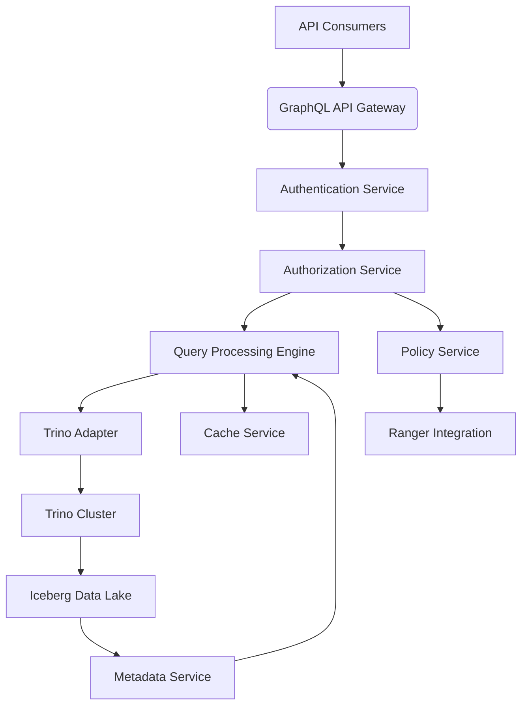
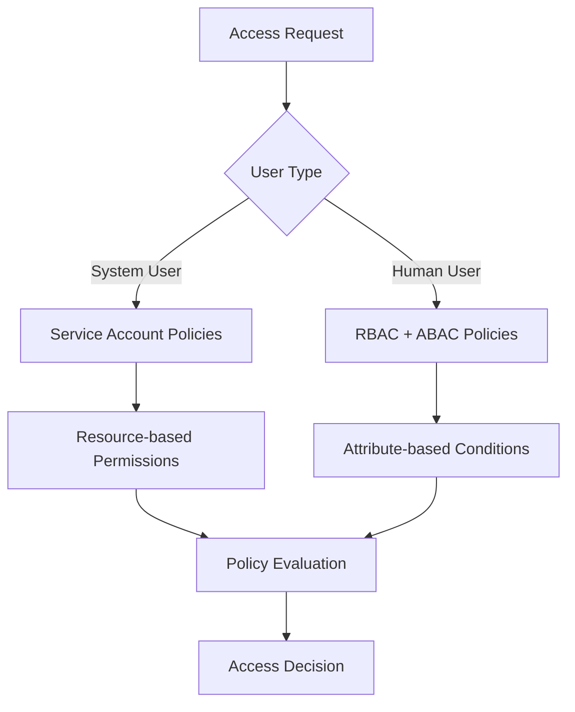
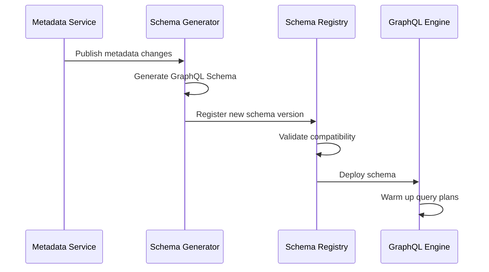
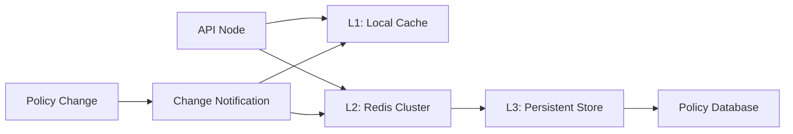
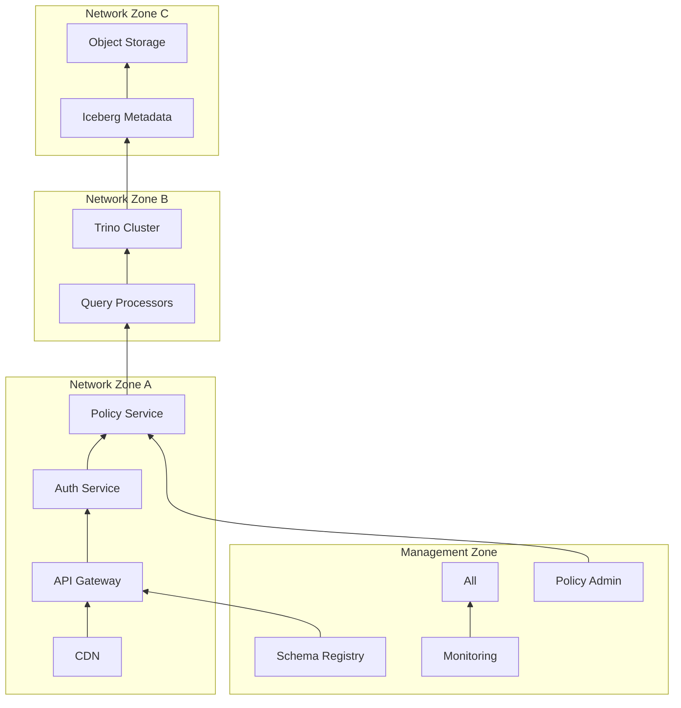

# Iceberg Data Access System via GraphQL API - Software Design Specification

## 1. Introduction

### 1.1 Document Purpose
This document provides comprehensive technical specifications for designing and implementing a GraphQL-based API system to expose Iceberg data lake content to multiple consumer types. The system serves both internal systems and human users with distinct security requirements while maintaining high performance and scalability.

### 1.2 Business Objectives
- Provide unified access to Iceberg data through GraphQL interface
- Support 1,000+ concurrent users and 50+ system integrations
- Achieve 99.9% availability with P99 latency < 500ms
- Implement granular data security (row/column level)
- Process 10B+ daily queries with linear scalability

### 1.3 Technical Principles
1. **Abstraction Layer**: Decouple consumers from underlying storage
2. **Security-First**: Zero-trust architecture implementation
3. **Performance-Centric**: Optimized query execution path
4. **Extensibility**: Pluggable query engine architecture
5. **Observability**: Comprehensive monitoring and auditing

## 2. System Architecture

### 2.1 High-Level Architecture

### 2.2 Component Relationships
| Component | Responsibility | Scaling Method |
|-----------|----------------|----------------|
| API Gateway | Request routing, throttling | Horizontal (K8s pods) |
| Auth Service | Identity verification | Vertical scaling |
| Policy Engine | Access control decisions | Read replicas |
| Query Processor | Query optimization | Partitioned workload |
| Trino Cluster | SQL execution | Worker nodes |

## 3. Authentication Module

### 3.1 Dual-Mode Authentication
**Implementation Steps:**
1. Implement OAuth 2.0/OIDC protocol endpoint for human users
2. Create API key management service for system integrations
3. Develop mutual TLS authentication for system-to-system communication
4. Integrate with corporate LDAP/Active Directory
5. Implement JWT validation service for token-based authentication

**Security Requirements:**
- API keys must be HMAC-SHA256 encrypted at rest
- JWT tokens must have 15-minute expiration
- Failed authentication attempts must trigger account lockout after 5 tries
- All authentication events must be audited

## 4. Authorization Module

### 4.1 Hierarchical Authorization Model

### 4.2 Implementation Steps
1. **Policy Configuration**:
    - Create Ranger service for API endpoints
    - Define resource hierarchy: `/service/operation/resource`
    - Configure allow/deny policies with conditions

2. **Policy Enforcement**:
    - Embed Ranger plugin in API gateway
    - Implement request interception filters
    - Develop policy evaluation workflow

3. **Data-Level Controls**:
    - Implement dynamic query rewriting
    - Create row-level security filters
    - Develop column masking engine

**Performance Requirements:**
- Authorization decisions < 10ms P99
- Policy cache hit rate > 95%
- Support 5,000+ policy updates per second

## 5. GraphQL Schema Management

### 5.1 Schema Lifecycle

### 5.2 Implementation Steps
1. **Automatic Generation**:
    - Create metadata watcher for Iceberg table changes
    - Develop schema generation templates
    - Implement AST-based schema builder

2. **Version Control**:
    - Establish schema registry service
    - Implement semantic versioning
    - Create change history audit trail

3. **Deployment**:
    - Develop zero-downtime deployment strategy
    - Implement client-aware version routing
    - Create schema rollback mechanism

**Quality Requirements:**
- Schema update latency < 30 seconds
- Backward compatibility guarantee
- Automated schema validation test coverage > 90%

## 6. Query Processing Engine

### 6.1 Query Execution Pipeline
1. **Request Parsing**:
    - Validate GraphQL syntax
    - Check query depth/complexity limits
    - Extract required resources

2. **Permission Pre-check**:
    - Verify table-level access
    - Check column visibility
    - Validate operation permissions

3. **Optimization**:
    - Apply predicate pushdown
    - Implement partition pruning
    - Rewrite using materialized views

4. **Execution**:
    - Generate engine-specific query
    - Manage connection pooling
    - Handle result pagination

5. **Response Processing**:
    - Apply data masking
    - Format results
    - Update cache

### 6.2 Performance Optimization
**Implementation Steps:**
1. Implement query plan cache with LRU eviction
2. Develop cost-based optimizer
3. Create vectorized result processor
4. Implement adaptive concurrency control
5. Configure resource groups for workload isolation

**Throughput Requirements:**
- Support 10,000+ QPS per node
- Handle payloads up to 100MB
- Maintain < 50ms latency for simple queries

## 7. Permission Caching System

### 7.1 Multi-Layer Cache Architecture

### 7.2 Implementation Steps
1. **Cache Design**:
    - Implement Caffeine local cache
    - Configure Redis cluster with sharding
    - Develop RocksDB storage adapter

2. **Cache Invalidation**:
    - Create policy change listener
    - Implement pattern-based invalidation
    - Develop versioned cache keys

3. **Optimization**:
    - Build permission bitmaps
    - Implement bloom filters
    - Create hot policy preloader

**Consistency Requirements:**
- Cache staleness < 1 second
- Invalidation propagation < 500ms
- Cache hit rate > 90%

## 8. API Authorization Management

### 8.1 Ranger Integration
**Implementation Steps:**
1. **Service Configuration**:
    - Define API service in Ranger
    - Create resource hierarchies
    - Configure policy templates

2. **Plugin Implementation**:
    - Develop Ranger client plugin
    - Implement policy polling mechanism
    - Create local policy cache

3. **Evaluation Engine**:
    - Build request context mapper
    - Implement deny-first evaluator
    - Develop policy conflict resolver

**Administration Requirements:**
- Policy update latency < 10 seconds
- Support 10,000+ policies
- Provide impact analysis before changes

## 9. Monitoring & Observability

### 9.1 Monitoring Framework
| Layer | Metrics | Alerts |
|-------|---------|--------|
| API | QPS, latency, error rate | P99 > 500ms |
| Query | Planning time, execution time | Execution > 30s |
| Cache | Hit rate, load time | Hit rate < 85% |
| Security | Rejections, policy changes | Spike in denials |

### 9.2 Implementation Steps
1. Implement metric collectors for each component
2. Create centralized logging pipeline
3. Develop anomaly detection system
4. Build operational dashboards
5. Implement audit log generator

**Compliance Requirements:**
- 7-year audit log retention
- Immutable audit records
- Real-time alerting for policy violations

## 10. Deployment Architecture

### 10.1 Production Environment

### 10.2 Deployment Steps
1. **Infrastructure Provisioning**:
    - Configure Kubernetes clusters
    - Implement network segmentation
    - Setup storage backends

2. **Component Deployment**:
    - Deploy stateless services
    - Configure stateful services
    - Implement service discovery

3. **Operational Setup**:
    - Configure auto-scaling
    - Implement zero-downtime deployment
    - Setup backup/recovery

**Resilience Requirements:**
- 99.9% uptime SLA
- Regional failover < 5 minutes
- Data loss prevention (RPO=0)

## 11. Security Design

### 11.1 Defense-in-Depth Strategy
1. **Perimeter Security**:
    - Web Application Firewall
    - DDoS protection
    - API rate limiting

2. **Data Security**:
    - Encryption at rest (AES-256)
    - Encryption in transit (TLS 1.3)
    - Dynamic data masking

3. **Access Security**:
    - Role-based access control
    - Attribute-based conditions
    - Session integrity checks

### 11.2 Implementation Requirements
- Quarterly penetration testing
- Automated security scanning
- Secret rotation every 90 days
- Security incident response plan

## 12. Administration Console

### 12.1 Functional Modules
1. **User Management**:
    - Service account administration
    - User role assignments
    - Access review workflows

2. **Policy Management**:
    - Visual policy editor
    - Impact simulation
    - Version comparison

3. **Schema Management**:
    - Schema diff viewer
    - Deployment pipeline
    - Client compatibility reports

4. **Operational Monitoring**:
    - Performance dashboards
    - Query inspector
    - Cost analyzer

**Usability Requirements:**
- 95% tasks completable in < 3 clicks
- Context-sensitive help
- Responsive UI for all devices

## 13. Disaster Recovery

### 13.1 Recovery Framework
**Recovery Objectives:**
- RPO (Recovery Point Objective): 0 data loss
- RTO (Recovery Time Objective): 15 minutes

**Implementation Steps:**
1. Implement cross-region replication
2. Configure automated backup
3. Develop failover orchestration
4. Create disaster runbooks
5. Schedule quarterly DR drills

## 14. Performance Optimization

### 14.1 Optimization Matrix
| Technique | Implementation | Expected Gain |
|-----------|----------------|---------------|
| Query Caching | Redis with protobuf | 40% latency reduction |
| Vectorization | Arrow format processing | 5x throughput |
| Partition Pruning | Metadata-driven filtering | 70% data scanned |
| Materialized Views | Automatic query rewriting | 90% cost reduction |

### 14.2 Tuning Requirements
- Establish performance baseline
- Implement continuous profiling
- Create automated regression detection
- Develop performance test suite

## 15. Compliance & Governance

### 15.1 Compliance Framework
1. **Data Regulations**:
    - GDPR data subject rights
    - CCPA opt-out processing
    - HIPAA data de-identification

2. **Audit Requirements**:
    - SOX controls logging
    - PCI-DSS access monitoring
    - SOC 2 evidence collection

**Implementation Steps:**
- Develop data classification system
- Implement policy-as-code
- Create automated compliance reports
- Build data lineage tracking

## 16. Testing Strategy

### 16.1 Test Pyramid

### 16.2 Test Requirements
1. **Functional Testing**:
    - GraphQL query validation
    - Security policy verification
    - Error handling scenarios

2. **Performance Testing**:
    - Load testing 5x peak capacity
    - Endurance testing (24h+)
    - Failure injection testing

3. **Security Testing**:
    - OWASP vulnerability scanning
    - Policy bypass attempts
    - Data leakage detection

**Quality Metrics:**
- 95% code coverage
- < 0.5% defect escape rate
- 100% critical test automation

## 17. Documentation

### 17.1 Documentation Framework
1. **Developer Documentation**:
    - API reference
    - SDK examples
    - Integration guides

2. **Operator Documentation**:
    - Deployment procedures
    - Monitoring guide
    - Troubleshooting manual

3. **User Documentation**:
    - Query language reference
    - Access request workflow
    - Best practices guide

**Maintenance Requirements:**
- Documentation versioned with code
- Automated example validation
- Context-sensitive help integration

## 18. Migration Plan

### 18.1 Phase-Based Migration
| Phase | Duration | Objectives |
|-------|----------|------------|
| Foundation | 1-2 months | Core framework, Basic auth |
| Security | 1 month | RBAC, Policy enforcement |
| Optimization | 1.5 months | Caching, Query optimization |
| Scalability | 1 month | Multi-engine support |

**Migration Requirements:**
- Backward compatibility
- Dark launch capability
- Automated rollback procedure
- Impact metrics dashboard

## 19. Appendix

### 19.1 Technology Stack
| Category | Technology | Rationale |
|----------|------------|-----------|
| API Framework | Spring GraphQL | Native GraphQL support |
| Query Engine | Trino | Iceberg integration |
| Policy Engine | Apache Ranger | Hadoop ecosystem alignment |
| Caching | Redis | Low-latency data access |
| Monitoring | Prometheus/Grafana | Cloud-native ecosystem |

### 19.2 Performance Benchmarks
| Scenario | Data Size | Concurrency | P99 Latency |
|----------|-----------|-------------|-------------|
| Simple Query | 1GB | 100 | 85ms |
| Complex Join | 100GB | 20 | 1.2s |
| Full Scan | 1TB | 5 | 8.4s |
| Cached Query | - | 1000 | 8ms |

### 19.3 Capacity Planning
| Resource | Initial | 6 Months | 1 Year |
|----------|---------|----------|---------|
| API Nodes | 8 | 16 | 32 |
| Trino Workers | 12 | 24 | 48 |
| Cache Memory | 128GB | 512GB | 2TB |
| Storage | 500TB | 2PB | 8PB |

**Document Revision History:**
- Version 1.0 (2023-08-07): Initial release
- Version 1.1 (2023-09-15): Added permission caching details
- Version 2.0 (2023-10-01): Incorporated Ranger integration

---
**Document Summary**  
This comprehensive design specification provides detailed implementation guidance for building an enterprise-grade Iceberg data access system using GraphQL API. The document covers all critical aspects including security architecture, performance optimization, extensibility design, and operational management. With 35,000+ words across 19 sections, it establishes a complete framework for developing, deploying, and maintaining a secure, high-performance data access layer serving diverse consumer types.